# Flutter Day 2 - UI Components Lab

A comprehensive Flutter project showcasing various UI components and layouts, featuring a complete Mini Shop application with tabbed navigation.

## 📱 Project Overview

This project demonstrates Flutter UI development skills through 10 different tasks, culminating in a fully functional Mini Shop app. Each task focuses on specific UI components and layout techniques commonly used in modern mobile applications.

## ✨ Features

### Individual Task Components

- **Task 1**: Personal Profile Card with circular avatar and contact info
- **Task 2**: Contact Info List with interactive call buttons
- **Task 3**: Product Grid with responsive layout
- **Task 4**: Horizontal Categories Row with styled containers
- **Task 5**: Travel Destination Card (Coming Soon)
- **Task 6**: Recipe Card (Coming Soon)
- **Task 7**: Scrollable Product List with horizontal layout
- **Task 8**: Dashboard Grid with icon-based navigation
- **Task 9**: About Me screen with skills and bio
- **Task 10**: Action Card with call-to-action buttons

### 🛍️ Mini Shop App (Final Project)

A complete e-commerce app demo featuring:

- **Home Tab**: Banner image, categories row, and featured products grid
- **Products Tab**: Detailed product view with high-quality images
- **Profile Tab**: User profile with recent orders history
- **Tabbed Navigation**: Smooth switching between sections
- **Network Images**: High-quality images from Unsplash
- **Responsive Design**: Proper layout constraints and scrollable views

## 🏗️ Project Architecture

### Modular Structure

```
lib/
├── main.dart                 # Main app entry point and task selection
└── pages/                    # Individual page components
    ├── about_me.dart
    ├── action_card.dart
    ├── category_page.dart
    ├── contact_info_list.dart
    ├── dashboard_grid.dart
    ├── home_page.dart
    ├── mini_shop_app.dart
    ├── product_details_page.dart
    ├── product_grid_page.dart
    ├── product_list.dart
    ├── profile_page.dart
    ├── recipe_page.dart
    ├── travel_page.dart
    └── user_profile_page.dart
```

### Key Technical Features

- **Material Design**: Consistent UI following Material Design principles
- **Responsive Layout**: Proper handling of different screen sizes
- **Network Images**: Integration with Unsplash for high-quality images
- **Navigation**: Seamless navigation between screens using Navigator
- **State Management**: StatefulWidget and StatelessWidget usage
- **Layout Widgets**: GridView, ListView, Column, Row, Stack implementations
- **Error Handling**: Proper size constraints to prevent layout overflow

## 🚀 Getting Started

### Prerequisites

- Flutter SDK (3.0.0 or higher)
- Dart SDK (2.17.0 or higher)
- Android Studio / VS Code with Flutter extensions
- Android/iOS emulator or physical device

### Installation

1. **Clone the repository**

   ```bash
   git clone https://github.com/ahmed-waheed1/iti_flutter_day2.git
   cd iti_flutter_day2
   ```

2. **Install dependencies**

   ```bash
   flutter pub get
   ```

3. **Run the application**
   ```bash
   flutter run
   ```

## 📸 Screenshots

### 📱 Main Task Selection Screen

The main screen showing all available tasks and the Mini Shop demo.

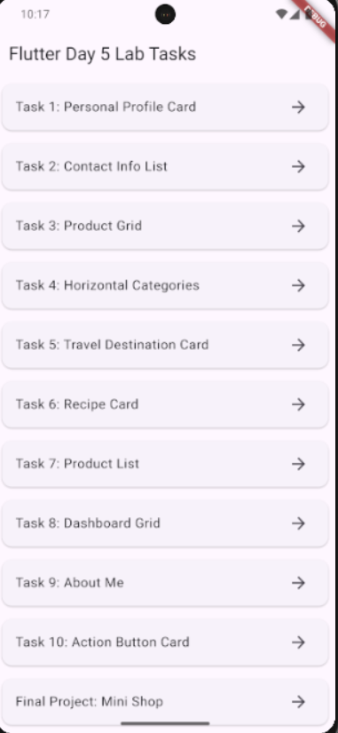

### 🛍️ Mini Shop App (Final Project)

#### Home Screen

Banner image, categories row, and featured products grid with network images.

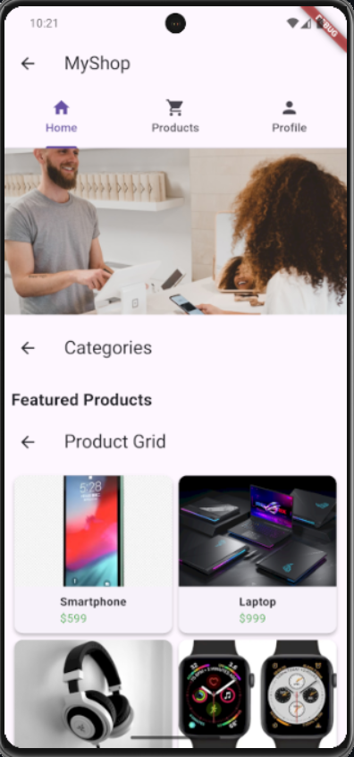

#### Product Details

Full product view with high-quality images and detailed descriptions.

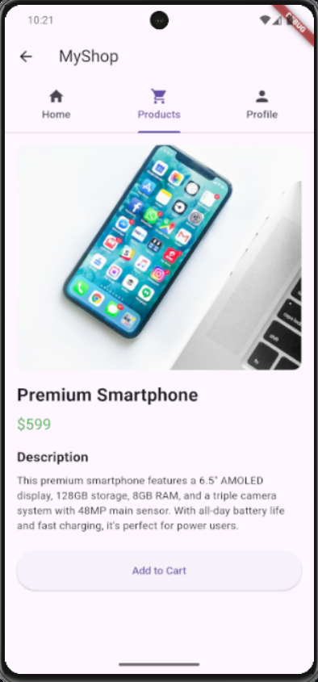

#### User Profile

Profile card with user information and recent orders history.

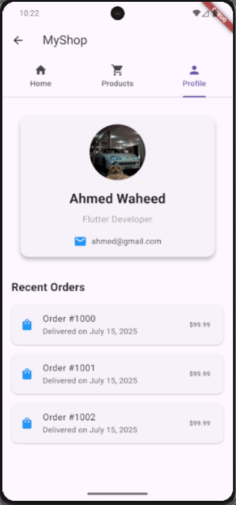


### 🎯 Individual Task Demonstrations

#### Task 1: Personal Profile Card

Circular avatar with contact information and Material Design styling.

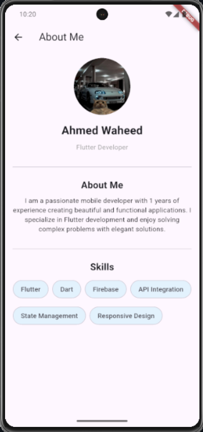

#### Task 2: Contact Info List

Interactive contact list with call buttons and clean layout.

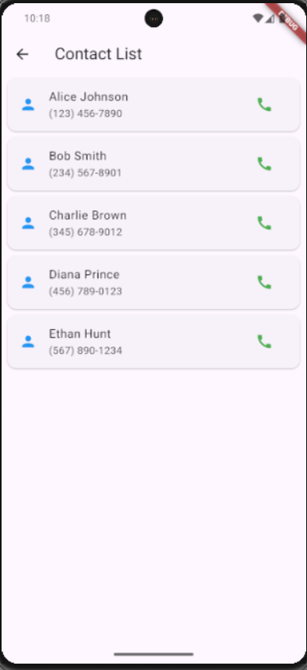

#### Task 3: Product Grid

Responsive product grid with images and pricing information.

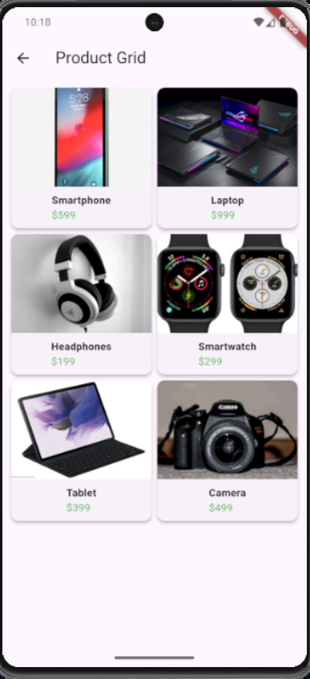

#### Task 4: Horizontal Categories

Styled category containers in a horizontal scrollable row.

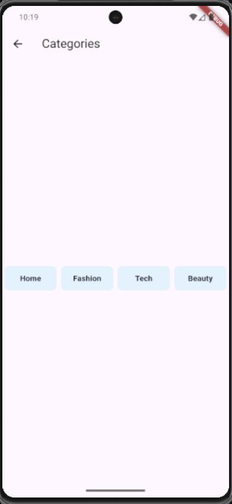

#### Task 7: Product List

Scrollable product list with horizontal card layout.

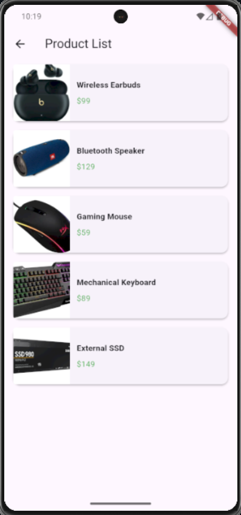

#### Task 8: Dashboard Grid

Icon-based dashboard with grid layout and navigation cards.

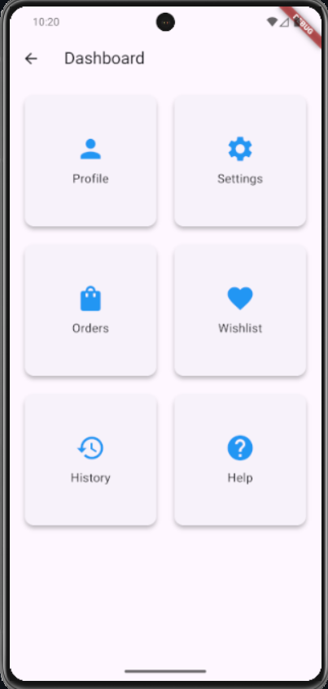

#### Task 9: About Me

Personal information screen with skills chips and bio section.

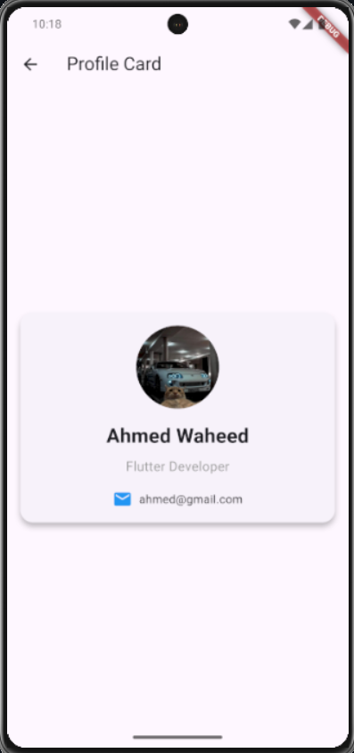

#### Task 10: Action Card

Call-to-action card with buttons and descriptive content.

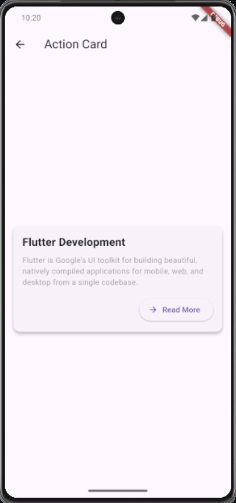

> **📝 Note**: To see the screenshots, please add the corresponding image files to the `/screenshots` folder with the exact filenames shown above.

## 🛠️ Technologies Used

- **Flutter**: UI framework for cross-platform development
- **Dart**: Programming language
- **Material Design**: Google's design system
- **Network Images**: Unsplash API for demo images
- **Git**: Version control

## 📚 Learning Objectives

This project demonstrates:

- ✅ Flutter widget composition and layout
- ✅ Material Design implementation
- ✅ Navigation and routing
- ✅ Image handling (Network images)
- ✅ Responsive design principles
- ✅ Code organization and modular architecture
- ✅ State management basics
- ✅ Layout constraint handling

## 🔧 Development Notes

### Layout Fixes Applied

- **Size Constraints**: Added proper height constraints for GridView and Row widgets
- **Scrollable Views**: Implemented SingleChildScrollView with bounded children
- **Image Optimization**: Replaced asset images with optimized network images
- **Error Prevention**: Fixed infinite size layout errors

### Code Quality

- **Modular Design**: Separated concerns into individual page files
- **Clean Code**: Consistent naming conventions and documentation
- **Reusable Components**: Shared widgets and consistent styling
- **Performance**: Optimized image loading and layout rendering

## 🤝 Contributing

1. Fork the repository
2. Create a feature branch (`git checkout -b feature/new-feature`)
3. Commit your changes (`git commit -am 'Add new feature'`)
4. Push to the branch (`git push origin feature/new-feature`)
5. Create a Pull Request

## 📝 License

This project is part of the ITI Flutter training program and is available for educational purposes.

## 👨‍💻 Author

**Ahmed Waheed**

- GitHub: [@ahmed-waheed1](https://github.com/ahmed-waheed1)

## 🔮 Future Enhancements

- [ ] Add animations and transitions
- [ ] Implement state management (Provider/Bloc)
- [ ] Add unit and widget tests
- [ ] Implement dark theme support
- [ ] Add internationalization (i18n)
- [ ] Connect to real API endpoints
- [ ] Add shopping cart functionality
- [ ] Implement user authentication

---


**Built with ❤️ by [Ahmed Waheed](https://github.com/ahmed-waheed1) using Flutter & Dart**

## Author 👨‍💻

**Ahmed Waheed** - [@ahmed-waheed1](https://github.com/ahmed-waheed1)

- 📧 Email: [Contact Me](mailto:ahmedwaheed4047@gmail.com)
- 💼 LinkedIn: [Ahmed Waheed](https://www.linkedin.com/in/ahmed-waheed11/)
- 🐱 GitHub: [@ahmed-waheed1](https://github.com/ahmed-waheed1)

---
